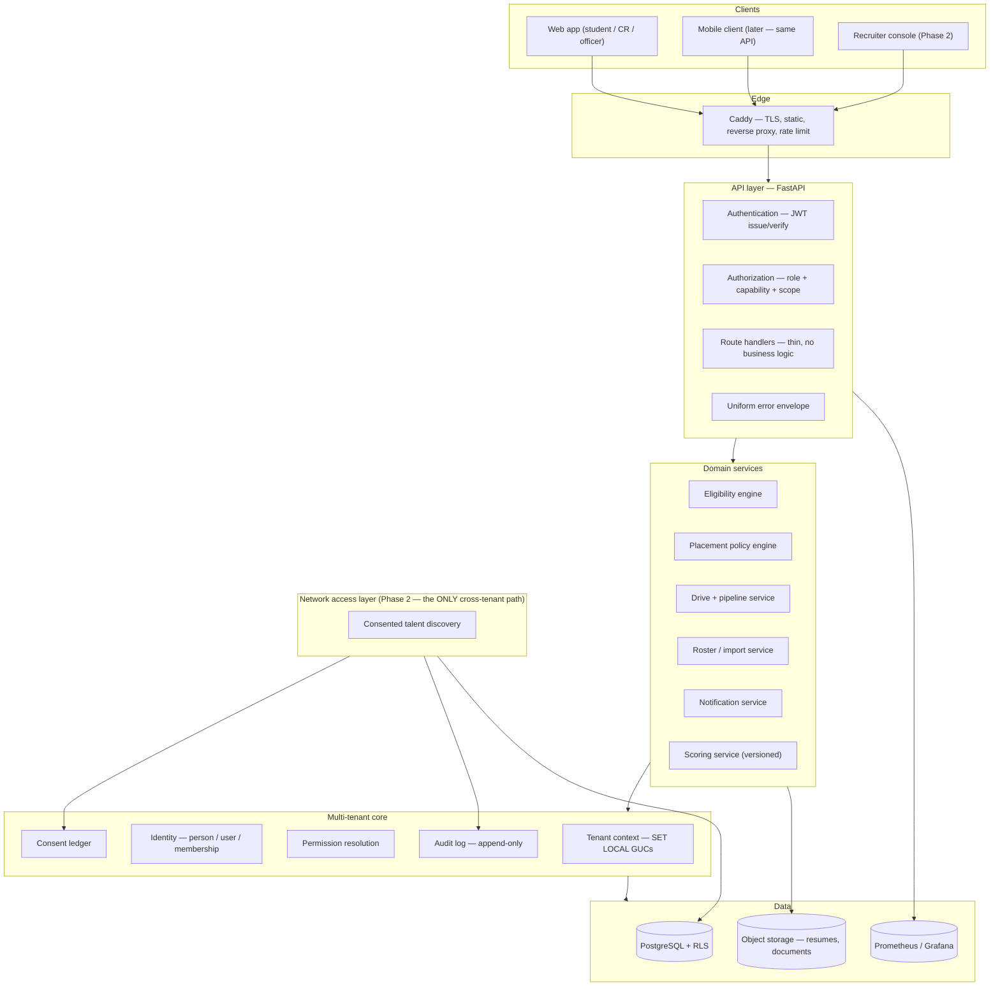

# Architecture

Target architecture for the placement platform (working name "Cohort"), written against the code as it actually exists on `develop` as of September 2026 — not against an idealised description of it.

Read [`PRODUCT_VISION.md`](PRODUCT_VISION.md) first for *why*. This document is *how*, and it is deliberately opinionated: where the current code and the target differ, both are stated, along with what triggers the change.

---

## 1. Where the system actually is today

This section is a factual inventory, verified by reading the files. It matters because several existing docs have drifted from the code, and design work built on a stale mental model produces the wrong plan.

**Backend** — FastAPI (`backend/app/`), SQLAlchemy Core (no ORM), psycopg, PostgreSQL. ~1,900 lines of Python across:

| Module | Responsibility |
|---|---|
| `main.py` | App wiring, CORS, Prometheus instrumentation, exception handlers, a schema-version guard middleware that 503s `/api/*` when migrations are behind |
| `db.py` | Engine + `tenant_connection(claims)` — the single most important function in the codebase |
| `auth.py` | JWT decode → `Claims` dataclass; dev-fallback header path, off by default |
| `security.py` | bcrypt hashing, JWT issuing, an in-memory `RateLimiter` |
| `permissions.py` | `CR_CAPABILITIES` catalogue + `require_staff` / `require_placement_officer` / `require_cr_capability` |
| `eligibility.py` | Safe JSON rule-tree evaluator (whitelisted ops, depth and condition caps) + college placement-policy engine |
| `scoring.py` | "Cohort Score v0" — weighted, explainable talent score |
| `errors.py` | Uniform `{"error":{"code","message","fields"}}` responses, no internal detail leakage |
| `routers/` | `auth_routes`, `dashboard`, `companies`, `students_admin`, `portal`, `admin_extra` — 38 endpoints total |

**Data** — pooled multi-tenancy. Every tenant row carries `college_id`, and isolation is enforced twice: in app code and in PostgreSQL Row-Level Security, with `FORCE ROW LEVEL SECURITY` on every table so even the table owner is subject to policy. Request context is injected as transaction-local GUCs (`app.role`, `app.college_id`, `app.branch_id`, `app.user_id`) via `SET LOCAL` semantics inside `engine.begin()`, so context cannot leak across pooled connections. The app connects as a non-superuser `app_user`. **This is the strongest part of the codebase and should not be redesigned.**

Base schema in `backend/db-init/01-schema.sql`; seven tracked migrations in `migrations/` add configurable eligibility (`0003`), the feature tables (`0004`), consent + coding profiles + score (`0005`), escalation notifications (`0006`), and configurable CR permissions (`0007`).

**Frontend** — two static HTML files served by Caddy, no build step. `frontend/public/index.html` is the landing page; `frontend/app/app.html` (813 lines) is a hash-routed SPA with a violet-accent, dark-default design system (`--acc:#6C5CF7`, Bricolage Grotesque / Inter / IBM Plex Mono) and role-aware navigation (`ADMIN_NAV` / `CR_NAV` / `STUDENT_NAV`) across ~15 views.

**Infra** — Docker Compose for local and AWS, Caddy as reverse proxy and static server, Prometheus + Grafana, MinIO in the stack, CloudFormation template, RDS setup and migration scripts.

**Two corrections to existing docs** (worth fixing so future work isn't misled): `docs/FRONTEND.md` documents a palette (`--indigo #3B4CC7`, `--gold`, `--teal`) and a route table that no longer match `app.html`; and `docs/BACKEND.md` predates `admin_extra.py`, `eligibility.py`, `permissions.py` and `scoring.py`, so it understates the system considerably.

### What this means

The honest summary: **the backend architecture is ahead of the product, and the product is ahead of its documentation.** The multi-tenant core the vision calls for largely exists. The gap is not "build the foundation" — it is hardening, correctness, and the operational surface around it.

One thing worth naming directly: `0005_consent_score.sql` and `scoring.py` are **Phase 2 infrastructure that already shipped into Phase 1**. Consent flags, linked coding profiles, a computed talent score and a `recruiter_candidates` view are the talent-network layer, not the placement OS. That isn't necessarily wrong — the data is cheap to start collecting, it's student-visible, and longitudinal signal only accrues if you start early. But the vision document says "don't build Phase 2," and the code says otherwise, so one of them should move. The recommendation in §7 is to keep it and reclassify it explicitly as "Phase 1.5 — the data foundation," with hard rules about what it may not do yet.

---

## 2. Architectural north star

The vision's central claim is that this is a **multi-tenant network, not merely multi-tenant SaaS**. That distinction has to mean something concrete in the architecture, or it is marketing. Here is what it means in practice:

| Ordinary multi-tenant SaaS | Multi-tenant network |
|---|---|
| Tenant data is isolated, full stop | Tenant data is isolated **by default**, with narrow, consented, audited paths across the boundary |
| Consent is a checkbox | Consent is an **event-sourced ledger** with scope, purpose, timestamp and revocation |
| Identity is per-tenant | Identity separates **the person** from **their enrolment at a tenant**, so it can outlive the enrolment |
| Signals are per-session | Signals are **longitudinal**, versioned, and reproducible |
| Audit is a nice-to-have | Audit is the **product surface** that makes cross-boundary access trustworthy |

Four architectural commitments follow from that table, and they are the things Phase 1 must get right even though Phase 2 is what consumes them:

1. **The cross-tenant boundary is a real, named component** — not an ad-hoc query. Today's `recruiter_candidates` view is the anti-pattern version of this (see [`SECURITY_REVIEW.md`](SECURITY_REVIEW.md) F-1). The correct shape is a single "network access layer" that is the *only* code path allowed to read across `college_id`, that requires a consent check per row, and that writes an audit record per access.
2. **Consent is data, not a boolean.** `students.consent_recruiter_share boolean` cannot answer "what exactly did this student agree to, when, under which policy version, and who saw their data as a result?" — which is precisely what India's DPDP Act framework and any serious college will ask. Replace with a `consent_events` append-only ledger, with the boolean kept as a derived cache.
3. **A person is not a student row.** `students` is a roster record scoped to a college. A talent profile that survives graduation, or a student who transfers, needs a `person` identity that the roster record points at. Retrofitting this after 50 colleges of data exists is genuinely painful; adding it now is a small migration.
4. **Everything consequential is audited from day one.** Not because Phase 2 needs it, but because "who changed this student's CGPA / marked this student placed / exported this roster" is a question a placement officer will ask in month two.

---

## 3. Layered architecture



**Rules that keep this honest:**

- Route handlers contain no business logic. Today `portal.py::register_for_drive` inlines the whole gate sequence (drive open → deadline → resume present → policy → rules → duplicate). That logic belongs in a `RegistrationService` so it can be unit-tested without HTTP and reused by a mobile client or a bulk admin action.
- Nothing below the API layer knows about HTTP. `permissions.py` currently raises `HTTPException` from what is otherwise a domain module — acceptable now, but it means the permission model can't be tested or reused outside FastAPI. Raise domain errors, translate at the edge.
- **No route handler ever calls `engine.connect()` directly.** Only `tenant_connection(claims)`. This rule already exists in `docs/BACKEND.md` and is correctly followed — keep it absolute.
- The network access layer does not exist yet and must not be built yet. What must exist now is the *seam*: consent ledger, audit log, person identity. Building the seam is Phase 1 work; building the layer is Phase 2.

---

## 4. Multi-tenancy

**Strategy: pooled, with RLS.** One database, one schema, `college_id` on every tenant row, policy enforced in Postgres. This is already implemented and it is the right choice for this product for a long time. Schema-per-tenant would multiply migration cost by the number of colleges and destroy the ability to compute network-level aggregates later; database-per-tenant would do the same and add cost per tenant, which is fatal for a price-sensitive Tier-2/3 market.

**Scaling path, with triggers rather than dates:**

| Stage | Trigger | Action |
|---|---|---|
| Single Postgres | now | Current setup. Fine to well past 50 colleges. |
| Add read replica | analytics queries measurably affecting write latency | Route `/api/analytics` and report exports to a replica |
| Partition hot tables | `applications` or `audit_log` past ~50M rows | Declarative partitioning by `college_id` range or hash |
| Extract heavy tenants | one college's load degrading others | Same code, separate database, routed by tenant registry |
| Regional split | data-residency requirement in a contract | Tenant registry gains a region column |

Every stage preserves the application code. That is the point of doing tenancy at the data layer.

**Two disciplines that must not slip:**

1. **Every new tenant table gets RLS in the same migration that creates it.** No exceptions, no "we'll add it after." The existing migrations do this correctly — `0004` and `0006` both enable and force RLS in the same file as the `CREATE TABLE`. Keep that.
2. **Every new tenant table carries `college_id` directly**, even when it could be derived by joining a parent. The schema comment on `round_progress` explains this already ("a cheap direct check"). A direct column keeps the policy simple, indexable, and impossible to get wrong through a join.

**Add a test that cannot be skipped:** a parameterised RLS test that, for every table in the schema, opens a connection as college A and asserts zero rows visible from college B. `backend/tests/test_p0_security.py` exists and should grow into exactly this, driven by `information_schema` so new tables are covered automatically rather than by remembering to add a case.

---

## 5. Identity and authorization

### 5.1 The model

The vision asks for `tenant → user → role → permission → resource → action`. The current code implements most of this; the gap is that capabilities exist only for CRs, and only as an app-layer allow-list.

**Target model:**

```
person            a human being, stable across time and institutions
  └── user        an authenticable account (email, credentials, external subject)
        └── membership   role @ (college, branch?) + capability grants + status
              └── capability  a named action the membership may perform
```

`memberships` already carries `role`, `college_id`, `branch_id`, `status` and (since `0007`) a `permissions` jsonb array. Generalise it:

- Capabilities apply to **every non-owner role**, not just `sub_admin`. A college with two placement officers may want one who can publish drives and one who can only manage the roster. The catalogue in `permissions.py` becomes role-scoped rather than CR-only.
- **The hierarchy is structural, not a permission.** The vision is explicit that a CR must never become equivalent to a placement officer. Enforce that by making a small set of capabilities *ungrantable* to `sub_admin` at the type level — `manage_cr_permissions`, `manage_policy`, `publish_drive`, `mark_placed`, `manage_memberships`, `export_full_roster`. Not "unchecked by default": impossible to check. This should be a constant in code and a `CHECK`-style validation on write, so no future UI bug or API call can grant them.
- **Capability resolution belongs in the request context, not in a per-check query.** `get_cr_permissions()` currently opens a fresh `tenant_connection` — a new transaction and round trip — on every capability check. Resolve once per request in a dependency and cache on `request.state`; better still, put the resolved capability list in the JWT with a `perm_epoch` claim, and bump a per-membership epoch column on any grant change so tokens issued before the change fail closed on next use.

### 5.2 Defence in depth

Three layers, each independently sufficient for the things it covers:

| Layer | Enforces | Failure mode if it's the only layer |
|---|---|---|
| RLS (Postgres) | tenant + branch + self row visibility | Cannot express "may view roster but not export codes" |
| Capability check (API) | which actions a membership may perform | Bypassed by any direct DB access or a missed decorator |
| UI affordances | what is worth showing | Trivially bypassed; **never** a security control |

The rule already in `CLAUDE.md` — backend authorization is authoritative — is correct. Add the corollary: **a capability check must be impossible to forget.** Today it is a manual call in each handler. Make it declarative (`@requires("manage_branch_pipeline")`) and add a test that enumerates every route and fails if any non-public route lacks either an explicit capability decorator or an explicit `@public` marker. That test is worth more than any amount of review discipline.

### 5.3 Sessions

Current: HS256 JWT, 8-hour expiry, no refresh, no revocation. Adequate for a pilot, insufficient once a college depends on it. Target: keep short-lived access tokens, add a refresh token with server-side revocation (a `sessions` table with `revoked_at`), so that "this CR graduated / this officer left" is an operation that actually ends access rather than waiting eight hours. Add `perm_epoch` as above. Consider RS256 later only if a second service ever needs to verify tokens independently — not before.

---

## 6. Domain services

The eligibility and policy engines are the technically strongest and most defensible parts of the product, and their design contract — *rules are data, never code; every failure returns a human reason* — is exactly right. Two extensions:

**Round pipeline.** `round_progress` exists in the schema but is referenced nowhere in the application; the pipeline is tracked only as `applications.current_round`, a single mutable text column. That means there is no round history, no per-stage timestamps, no "who moved this candidate and when", and therefore no stage-conversion analytics — which is one of the things a placement officer most wants and a "we built it ourselves" portal least often has. Start writing `round_progress` rows on every transition, with actor and timestamp, and derive `current_round` from the latest row rather than storing it independently.

**Scoring.** `scoring.py` is well-structured and explainable, which is right. Two problems to fix before it is shown to any recruiter or used in any ranking:

- *It is trivially gamed.* `coding` is `max()` over four signals, and one of them is `github.public_repos * 5` — twenty empty repositories produce a perfect coding sub-score, which is 30% of the total, in about ten minutes. Weight by signal quality, require non-trivial repository content, and prefer rated-contest signals over volume counts.
- *It is unversioned in practice.* The `version` field exists and is set to `v0`, but scores are stored as a jsonb blob on `students`. Store score history in its own table keyed by `(student_id, version, computed_at)` so that a weighting change is a new version rather than a silent rewrite of everyone's number. A student who screenshots a score of 74 and sees 61 next week with no explanation is a trust incident.

Until both are fixed, the score should be labelled clearly in the UI as a self-improvement signal, not a ranking.

---

## 7. Phase 1 / Phase 2 boundary, made concrete

The vision's rule — build Phase 1, don't build Phase 2, don't make Phase 2 painful — is only actionable if "the seams" are named. They are:

| Seam | Build in Phase 1 | Explicitly NOT in Phase 1 |
|---|---|---|
| Consent | `consent_events` ledger: person, scope, purpose, policy version, granted/revoked, timestamp, actor | Any UI that acts on consent to expose data outside the college |
| Identity | `person` table; `students.person_id`; profile survives graduation | Cross-college person matching/merging |
| Audit | `audit_log` on every mutation and every sensitive read | Recruiter-facing access transparency reports |
| Signals | Versioned score history; assessment *results* modelled generically | A common assessment product, proctoring, question banks |
| Access | The interface a network layer would call, defined and unused | The recruiter portal, subscriptions, search |

**The rule for reviewers:** a change is acceptable Phase 1 work if it makes a college's placement operation better *today* and happens to also be a seam. A change is Phase 2 scope creep if its only justification is a future company-side capability. `0005` fails that test as written — a `recruiter_candidates` view has no Phase 1 consumer — which is why the recommendation is to reclassify the consent/score work as "Phase 1.5, data foundation", drop the view until there is something to consume it, and keep the student-facing score because *that* has a Phase 1 justification (students act on it).

---

## 8. Architecture decisions

Numbered so they can be referenced in review, with the alternatives that were rejected.

**ADR-01 — Keep pooled multi-tenancy with Postgres RLS.**
*Alternatives:* schema-per-tenant, database-per-tenant, application-only filtering.
*Rationale:* application-only filtering is one missing `WHERE` clause from a breach and cannot be audited; per-tenant isolation multiplies migration and cost per college and forecloses network-level aggregates. RLS gives a second, independent enforcement layer that a code bug cannot bypass.
*Consequence:* every new table needs a policy; a superuser connection would silently bypass everything, so the app must never connect as one. Both already handled.

**ADR-02 — Stay a modular monolith.**
*Alternatives:* microservices now.
*Rationale:* one team, pre-adoption, and the dominant cost is product iteration, not scaling. Distributed transactions across tenant context would be a large self-inflicted wound.
*Consequence:* enforce module boundaries in-process (`routers/` → `services/` → `core/`) so that extraction later is mechanical. First realistic extraction candidate is assessments in Phase 2, because it has different scaling and isolation characteristics.

**ADR-03 — Rules as data, interpreted by a whitelisted evaluator.**
*Status:* already implemented in `eligibility.py`, retained deliberately.
*Rationale:* colleges' eligibility rules genuinely differ; encoding them in code means an engineer per college, which does not scale and is the reason competing portals feel rigid. A whitelisted operator set with depth and count caps gives configurability without an injection surface.
*Consequence:* the rule builder UI is now a first-class product surface, and rule trees need versioning so a mid-drive rule change is visible rather than silent.

**ADR-04 — Consent as an append-only event ledger, not a flag.**
*Alternatives:* the current boolean column.
*Rationale:* a boolean cannot answer scope, purpose, time or revocation history, all of which are needed for DPDP-style compliance and for college trust; and a boolean is destructively overwritten, so revocation loses the fact that access previously occurred.
*Consequence:* one extra table and a derived cache column. Small now, very large later.

**ADR-05 — Separate `person` from `student` roster record.**
*Alternatives:* keep `students` as the identity.
*Rationale:* Phase 2's entire premise is a profile that outlives one college enrolment; also handles transfers, re-admission and alumni cleanly.
*Consequence:* a nullable `person_id` added now and backfilled is cheap; adding it after multi-college adoption means an identity-resolution project.

**ADR-06 — Object storage for documents, not `bytea`.**
*Current:* `resumes.data bytea` in Postgres, with the migration comment already anticipating the change; MinIO is already in the compose stack.
*Rationale:* resumes in-row bloat the database, every backup, and every restore; streaming large blobs through the API ties up workers.
*Consequence:* move to presigned-URL upload/download against MinIO/S3 with the same API surface. Do this before the first college with more than a few hundred students uploads resumes, not after.

**ADR-07 — No frontend framework yet; migrate on a defined trigger.**
*Alternatives:* React/TypeScript now.
*Rationale:* two static files with no build step is genuinely fast to iterate and trivially deployable, and 813 lines is not yet unmanageable.
*Trigger to migrate:* when any two of these are true — the app file passes ~1,500 lines, a second developer works on the frontend concurrently, or a mobile client needs shared view logic. At that point migrate to Vite + TypeScript, component-per-view, keeping the existing design tokens verbatim.
*Consequence:* until then, discipline substitutes for tooling: keep views as pure functions, keep `api()` the single fetch path, and do not introduce a second state pattern.

**ADR-08 — All cross-tenant reads go through one auditable component (Phase 2).**
*Rationale:* the network is the moat and the liability at the same time; concentrating the boundary in one place is what makes it reviewable, testable and explainable to a college.
*Consequence:* no view, query or endpoint outside that component may omit a `college_id` predicate. Enforce with a test that greps the SQL surface, plus code review.

---

## 9. Non-functional targets

Concrete enough to test, modest enough to be real for a pilot.

| Concern | Target | How it's met |
|---|---|---|
| API latency | p95 < 300 ms for reads, < 800 ms for the eligibility sweep | Indexes exist on tenant+branch+status; batch the per-drive evaluation loop in `/api/me/drives` |
| Availability | 99.5% during placement season | Single box is acceptable for pilot; document the RTO honestly |
| Backup | Nightly automated, restore tested quarterly | RDS automated backups; **an untested restore is not a backup** |
| Auth | Rate-limited login, lockout on repeated failure | Exists in-process; move to Redis before running >1 worker |
| Observability | Every 5xx traceable to a request; error rate and latency dashboards | Prometheus + Grafana already in the stack; add structured request logging with a request ID |
| Data | Tenant isolation provable by test | Automated per-table RLS test (§4) |
| Recovery | New college onboarded with zero engineering | The real Phase 1 exit criterion; see [`GTM_ROLLOUT.md`](GTM_ROLLOUT.md) |

Two operational gaps worth naming: the in-memory rate limiter silently stops working correctly the moment there is more than one worker process, and CORS is `allow_origins=["*"]` with all methods. Neither is exploitable in the current single-origin Caddy deployment, but both are the kind of thing that becomes exploitable during an otherwise unrelated infrastructure change.

---

## 10. Sequenced engineering plan

Ordered by dependency, not by ambition. Each block should be shippable and reviewable on its own.

**Block A — Correctness and trust (before any pilot college).**
Fix the findings in [`SECURITY_REVIEW.md`](SECURITY_REVIEW.md); add the automated per-table RLS test and the every-route-authorized test; add `audit_log` and write to it from every mutation; make capability resolution per-request; add refresh tokens with revocation.

**Block B — The operational surface a placement officer actually lives in.**
Round history via `round_progress` with actor and timestamp; the pipeline board UI; bulk actions on candidates; the "what needs my attention today" action queue; export that satisfies NAAC/NBA/NIRF reporting formats (this is the budget unlock — see the GTM plan); notification delivery beyond in-app.

**Block C — Self-service onboarding.**
College creation, branch setup, roster import with mapping preview and error report, activation-code issue and delivery, placement-policy configuration, CR appointment with the capability matrix — all without an engineer. This block is the actual Phase 1 exit criterion.

**Block D — The data foundation (Phase 1.5).**
`person` identity; `consent_events` ledger replacing the boolean; versioned score history; scoring anti-gaming fixes; documents to object storage.

**Block E — Phase 2, gated.**
Do not start until the gates in the GTM plan are met. Assessment result modelling, then the network access layer, then the recruiter console.

**Explicitly not now:** microservices, Kubernetes, a mobile app, a frontend framework rewrite, an ML-based score, real-time collaboration, or a public API.
