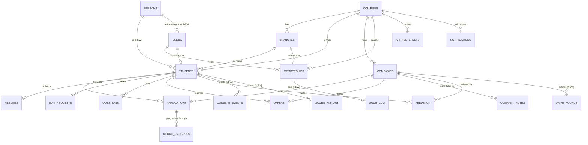
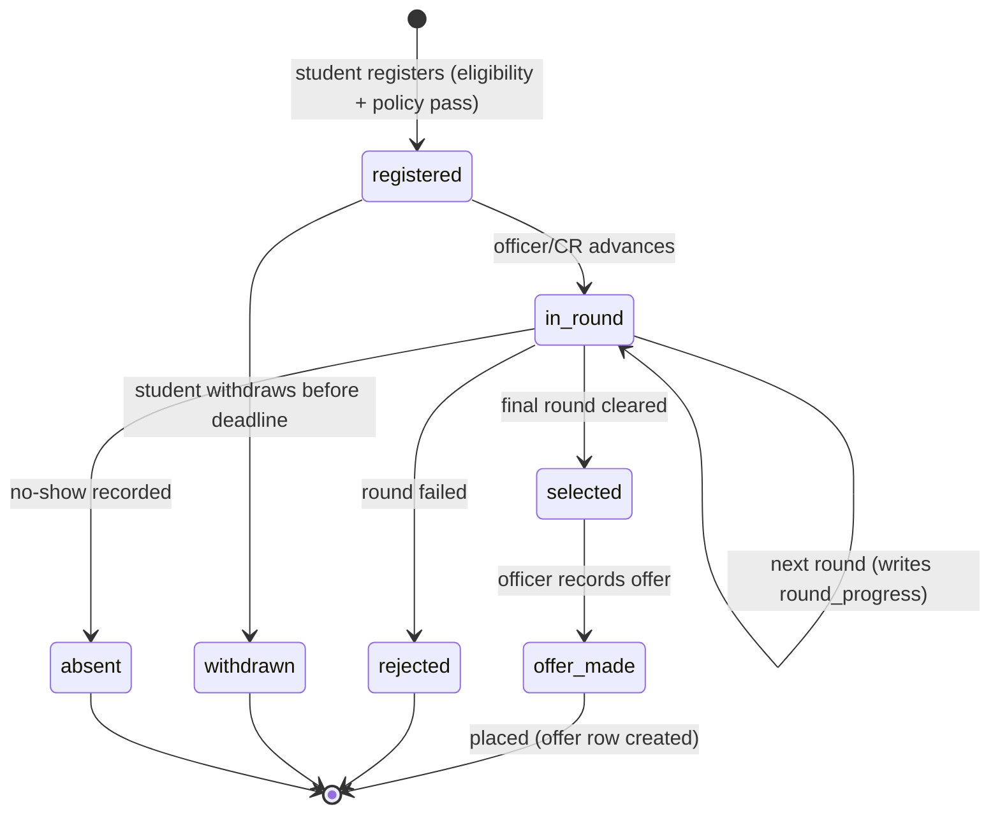
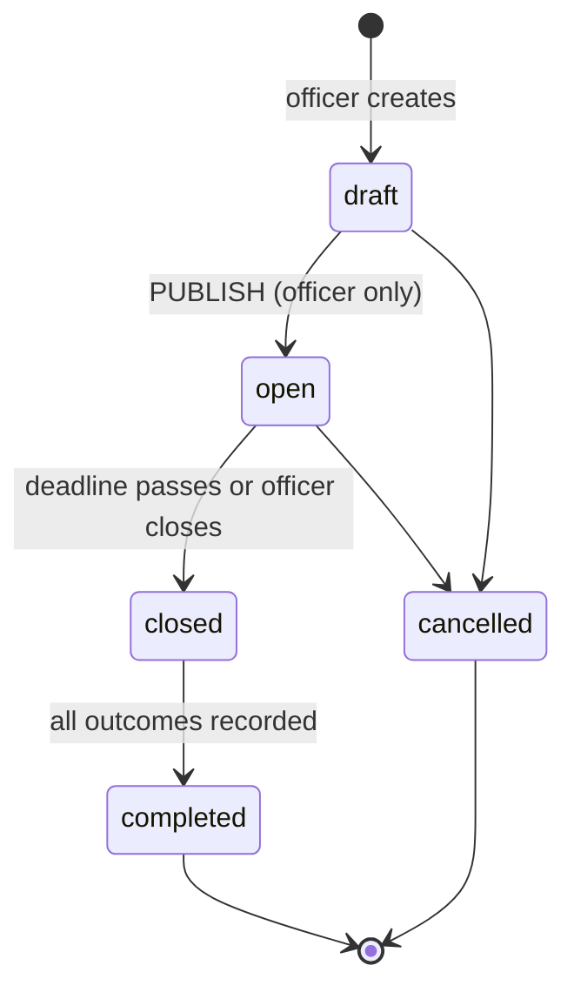
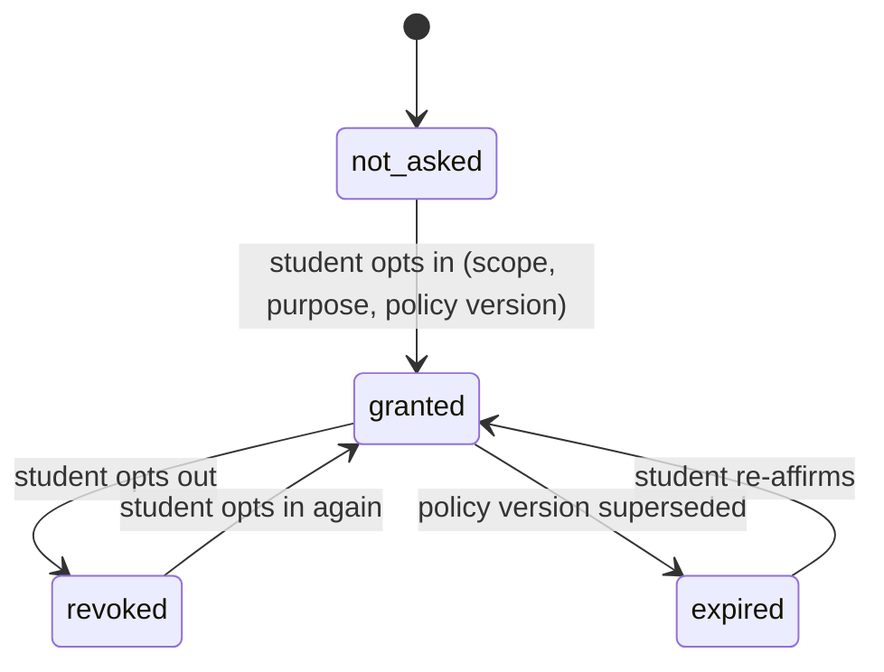

# Domain model

Entities, relationships, state machines and the permission model. Current state is drawn from `backend/db-init/01-schema.sql` plus migrations `0002`–`0007`; proposed additions are marked.

---

## 1. Entity relationship diagram

Existing tables in the core; proposed additions marked `[NEW]`.



### Entity dictionary

| Entity | Purpose | Notes / risks |
|---|---|---|
| `colleges` | The tenant. Carries `slug`, `email_domain`, `status`, and `placement_policy` jsonb | `email_domain` drives SSO auto-mapping; validate it is not a public domain like gmail.com or anyone with that address joins the tenant |
| `branches` | Department within a college | Scope unit for CRs and for most analytics |
| `users` | Authenticable account — email, optional `password_hash`, optional `external_auth_id` | Globally unique email. A person at two colleges is currently one user with two memberships, which is correct |
| `memberships` | `role @ (college, branch?)` + `permissions` jsonb + `status` | The authorization spine. `UNIQUE(user_id, college_id, role)` |
| `students` | Roster record — the source of truth for "is a real student here" | `UNIQUE(college_id, roll_no)`. Holds `attributes` jsonb, `activation_code`, consent flag, `coding_profiles`, `cohort_score` |
| `companies` | A recruiter *and* a drive, conflated | See §2 — this conflation is the model's main weakness |
| `applications` | A student's participation in a drive | `UNIQUE(company_id, student_id)` prevents duplicates |
| `round_progress` | Per-round outcome for an application | **Exists in schema, written by no code.** See §3 |
| `offers` | A placement outcome, feeds policy checks | `is_special` marks dream/super-dream style exceptions |
| `feedback` | Interview experience knowledge base | Genuinely differentiating content; currently under-surfaced in the UI |
| `attribute_defs` | Per-college registry of extra student fields | Drives both the CSV import mapping and the rule builder |
| `resumes` | One per student, stored as `bytea` | Move to object storage — ADR-06 |
| `edit_requests` | Student-proposed correction, admin-approved | Good pattern: roster stays authoritative, students aren't blocked |
| `questions` | Student Q&A with CR escalation | `open → escalated → answered` |
| `company_notes` | Placement-cell calendar and notes | `visit / test / deadline / note` |
| `notifications` | Role-addressed inbox item | Currently only `question_escalated` |
| `persons` `[NEW]` | The human, stable across enrolments | ADR-05 |
| `consent_events` `[NEW]` | Append-only consent ledger | ADR-04 |
| `audit_log` `[NEW]` | Append-only record of consequential actions | Needed in Phase 1, not Phase 2 |
| `score_history` `[NEW]` | Versioned score snapshots | Replaces the mutable jsonb blob |
| `drive_rounds` `[NEW]` | Per-drive configurable round sequence | Replaces the hardcoded round vocabulary |

---

## 2. The `companies` conflation

`companies` currently means both "an organisation that recruits" and "a specific hiring drive at this college this season". That is why the table carries `package`, `min_cgpa`, `deadline`, `status` and `eligible_branches` — all drive attributes, not company attributes.

It works today and it is not urgent. It becomes a real problem at three predictable moments: when a company runs two roles in one season (SDE and Analyst, different packages and eligibility), when a college wants last year's history for the same recruiter, and — decisively — in Phase 2, when a company is an *account* on the platform spanning many colleges.

**Proposed split, when Block B is touched anyway:**

```
organisations   name, sector, website, canonical identity   (college-scoped now, network-level later)
    └── drives  role, package, eligibility_rules, deadline, status, season, college_id
            └── drive_rounds   ordered round definitions
                    └── applications → round_progress
```

Migrate by renaming `companies` to `drives`, adding `organisation_id`, and creating `organisations` from the distinct names. Keep a compatibility view named `companies` for one release so the frontend can migrate independently.

**Do not do this now** if it delays a pilot. Do it before the second season of data exists, because the cost grows with history.

---

## 3. Round pipeline: the gap worth closing

The schema defines `round_progress` with `(application_id, round, status, feedback, updated_at)` and a unique constraint per round. Nothing in `backend/app/` reads or writes it — verified by grep. The live pipeline is `applications.current_round`, a single mutable text value drawn from a vocabulary hardcoded across the seed data and the frontend (`resume_screening`, `online_assessment`, `technical_1..3`, `hr`, `final_placement`).

What that costs:

- No history — you cannot answer "when did this candidate clear the OA?"
- No actor — you cannot answer "who moved 40 students to rejected on Tuesday?"
- No conversion analytics — stage-to-stage drop-off is the single most useful placement metric and it is currently uncomputable
- No per-drive round configuration — a drive with two technical rounds and one with four use the same fixed vocabulary

**Fix:** make `round_progress` the write path. Every transition inserts or updates a row with `actor_user_id` and `changed_at`; `applications.current_round` becomes a derived cache updated in the same transaction (keep it — it makes list queries cheap). Add `drive_rounds` so each drive declares its own ordered sequence, with the current vocabulary as the default template. This is a contained change with high analytic payoff.

---

## 4. State machines

**Application lifecycle**



Current `applications.status` vocabulary is `active | placed | rejected | withdrawn`. `absent` and an explicit `selected` (cleared, offer not yet recorded) are worth adding — placement cells track both, and `absent` matters because repeated no-shows are a policy trigger at many colleges.

**Drive lifecycle**



`companies.status` is currently `int` — `0 draft, 1 open, 2 closed`. Two changes: make it a text enum for readability and to allow `completed`/`cancelled`, and treat **publish as a distinct, capability-gated action**, not a field edit. A drive leaving draft is the moment it becomes visible to every student in the college; it deserves to be an explicit, audited action that only a placement officer can take. (This is also where the current draft-visibility bug lives — see `SECURITY_REVIEW.md` F-2.)

**Consent lifecycle** `[NEW]`



Every transition is an **append** to `consent_events`, never an update. `students.consent_recruiter_share` remains as a derived cache of the latest event, so existing queries keep working.

**Question lifecycle** — `open → escalated → answered`, already implemented, with `0006` creating a durable role-addressed notification on escalation. This is a good pattern; reuse it for edit requests and for drives approaching deadline with low registration.

---

## 5. Permission model

### 5.1 Structure

```
Placement Officer / College Admin   (role: admin)
            ↓  may grant a subset of, never all of, its own authority
        CR / Branch representative  (role: sub_admin, scoped to one branch)
            ↓
        Students                    (role: student / alumni)
```

`owner` sits outside the tenant hierarchy — it is the platform operator scope, used by the auth service and support. It should be used by as little code as possible and every use of it should be audited, because it bypasses every RLS policy by design.

### 5.2 Capability catalogue

Existing (in `permissions.py`, CR-only):

| Key | Grantable to CR | Meaning |
|---|---|---|
| `view_branch_dashboard` | yes | Branch-scoped counts and funnel |
| `view_branch_roster` | yes | Students and login status for the branch |
| `manage_branch_pipeline` | yes | Update interview rounds, not final statuses |
| `manage_branch_questions` | yes | See and escalate branch questions |
| `view_activation_codes` | yes | Export unclaimed activation codes for the branch |

Proposed additions, and the **ungrantable set** that structurally protects the hierarchy:

| Key | Grantable to CR | Rationale |
|---|---|---|
| `view_branch_analytics` | yes | Read-only, branch-scoped |
| `record_round_outcome` | yes | Distinct from advancing the whole pipeline |
| `post_branch_announcement` | yes | With officer visibility of what was sent |
| `manage_cr_permissions` | **never** | A CR granting themselves authority is the failure mode the hierarchy exists to prevent |
| `publish_drive` | **never** | Makes a drive visible college-wide |
| `manage_policy` | **never** | Changes eligibility for everyone |
| `mark_placed` / `record_offer` | **never** | Final outcomes are the officer's accountability |
| `manage_memberships` | **never** | Appointing staff is an officer action |
| `export_full_roster` | **never** | Whole-college PII |
| `manage_college_settings` | **never** | Tenant configuration |

"Never" must mean *cannot be represented*, not *unchecked by default*: keep an explicit `CR_UNGRANTABLE` constant, validate on write in the grant endpoint, and add a test asserting the intersection of `CR_GRANTABLE` and `CR_UNGRANTABLE` is empty. Today `normalize_cr_permissions()` filters against `CR_CAPABILITY_KEYS`, which is the right mechanism — it just needs the officer-only keys added to a separate set so the two can never overlap.

### 5.3 Resolution algorithm

```
resolve(request):
  claims        ← verify JWT                        (401 if absent/invalid/expired)
  membership    ← active membership for (user, college) in claims
  if none                                            → 403
  if claims.perm_epoch < membership.perm_epoch       → 401, force re-auth
  capabilities  ← role_baseline(role) ∪ granted(membership.permissions)
                  minus UNGRANTABLE if role = sub_admin
  cache on request.state
  per endpoint: required capability ∈ capabilities   else 403
  per query:    RLS enforces tenant/branch/self independently
```

Two properties worth preserving: capability resolution happens **once** per request (today it is a database round trip per check), and RLS remains independent — if the capability layer were entirely removed, a CR still could not read another branch's students, because the policy in the database says so.

### 5.4 Legacy behaviour

`normalize_cr_permissions(None)` returns the four `LEGACY_CR_CAPABILITIES` — a deliberate choice so CR memberships created before migration `0007` keep working until an admin saves an explicit list. That is correct for migration safety, but it should expire: once every existing CR membership has an explicit array, change the `None` case to return an empty list, so "no grants" means "no access" rather than "the old default". Track it as a dated cleanup, not an open-ended fallback.

---

## 6. Data classification

Needed for both DPDP-style compliance and for deciding what may ever cross a tenant boundary.

| Class | Examples | Cross-tenant | Retention |
|---|---|---|---|
| Public | College name, branch codes | Yes | Indefinite |
| Operational | Drive names, deadlines, aggregate counts | Aggregated only | Per college contract |
| Personal | Name, email, roll number, CGPA, backlogs, attributes | **Only with explicit consent event** | Enrolment + agreed period |
| Sensitive | Resumes, documents, interview feedback about a named student | **Never without per-purpose consent** | Shortest defensible |
| Derived | Cohort Score, coding profiles | Only with consent; always with the version that produced it | Versioned history |
| Platform | Audit log, consent ledger | Never | Long — these are the accountability record |

The practical rule: **anything in Personal or below is invisible outside its college unless a `consent_events` row says otherwise and an `audit_log` row records the access.** That single sentence is the difference between the network being an asset and being a liability.
