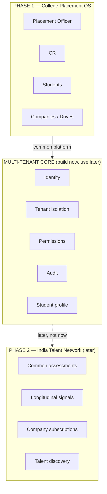

# Cohort — Product Vision & Founder Context

> **Read this before making architectural or product decisions.** This document exists so that every engineering session — human or AI — starts from the same north star instead of re-deriving it from the code, and so that Phase 1 work doesn't accidentally close doors that Phase 2 will need.

*Last updated: September 2026.*

---

## 0. What this document is

The current product is temporarily called **"Cohort."** The name will change later because "Cohort" is already taken elsewhere — do not spend engineering effort on branding/naming work yet.

This is not just a college placement website. The long-term ambition is a common digital placement and talent ecosystem usable by colleges and companies across India. **We are deliberately not building that yet.** Phase 1 is the entire priority right now, and this document exists mainly to stop Phase 1 work from drifting into premature Phase 2 scope — while making sure Phase 1's foundations (identity, tenancy, permissions, student profile, assessments, audit) don't make Phase 2 painful later.

---

## 1. Phase 1 — Digital Placement Operating System for Colleges

The immediate goal: make this platform the best practical digital placement system for **Tier‑2 and Tier‑3 colleges in India.**

Today, many colleges run placements through a combination of Google Forms, WhatsApp groups, spreadsheets, email, manually maintained student lists, manually tracked eligibility, fragmented placement records, and ad‑hoc communication between placement officers, CRs (class representatives) and students. The goal is to replace that with one proper platform, so a college can run its entire placement operation digitally from one system.

Scope that the platform should eventually cover:

student onboarding, student profiles, eligibility, placement drives, company/recruiter information, applications, shortlisting, rounds/pipelines, placement status, communication, documents/resumes, placement analytics, reports, placement policies, CR/representative workflows, placement officer administration, auditability, and historical placement data.

The core value proposition: *"Why would a college continue managing placements through WhatsApp, Google Forms and spreadsheets when one platform can handle the complete workflow?"*

---

## 2. The product must be better than colleges building it themselves

The main objection we'll face: *"Why should our college pay for this? We can build our own internal portal."*

The product must provide value that's genuinely hard for a single college to reproduce. We should not compete on "here is a better CRUD portal" alone. The product should be significantly easier to use, more polished, more reliable, more secure, easier to deploy and operate, continuously improved, analytically useful, standardized across colleges, and eventually capable of connecting colleges to a wider talent ecosystem.

Target reaction from a college: *"We could build something internally, but this platform is substantially better and saves us enough operational effort that building our own doesn't make sense."*

---

## 3. Multi-tenant platform

The long-term architecture is a common platform serving many colleges. Every college is a separate tenant: college data must remain properly isolated, users belong to their college/tenant, and college policies, permissions, workflows, and eventually branding/configuration can differ.

This must be designed as a serious multi-tenant SaaS platform, not as one college's portal duplicated many times. **Security and tenant isolation are extremely important — never sacrifice tenant isolation for convenience.**

---

## 4. Architectural principle: we are building a multi-tenant *network*, not merely multi-tenant SaaS

This distinction is explicit and important for how the architecture is judged going forward.

A normal multi-tenant SaaS says: *"500 colleges use my software."* Our long-term vision is different: *"500 colleges use the same trusted infrastructure, and that network creates capabilities that no individual college can reproduce."* That network effect — not the software license — is the real moat.

**But the moat must not be "we collected everyone's data."** Raw data aggregation without consent is not a moat, it's a liability. The moat is the *combination* of:

- the network itself (many colleges on shared, trusted infrastructure),
- longitudinal signals (performance data gathered legitimately over time),
- consent (students opt in to being discoverable),
- trust (colleges and students believe their data is handled correctly),
- assessment infrastructure (a common, credible way to measure ability), and
- employer access (companies come because the signal is good, not because the data is cheap).

Remove any one of those and it's not a moat — it's either a commodity SaaS product or a privacy problem. Every architectural decision about identity, tenancy, permissions, the student profile, assessments, and audit should be made so that this five-part moat is *possible later*, without building it now.

---

## 5. The common platform is the long-term moat (data ethics)

If many colleges use the same platform, it can eventually develop a much richer understanding of student talent, placement activity, skills, performance and outcomes. **This is not permission to expose one college's private data to another college.** Data ownership, consent, privacy, tenant isolation and appropriate access controls are fundamental to the architecture, not an afterthought. The long-term value comes from building a trusted ecosystem and earning data legitimately — not from casually aggregating or exposing private student information.

---

## 6. Phase 2 — company + student talent ecosystem (later, not now)

Only after Phase 1 works well and we have meaningful adoption and feedback from colleges should we expand here.

```
STUDENTS
   ↕
COLLEGES
   ↕
PLATFORM
   ↕
COMPANIES
```

The idea: companies should eventually discover strong students across participating colleges without the college being the only gateway. A student who consistently performs well on assessments, coding tests, aptitude tests, technical evaluations, and projects over four years could build a longitudinal talent profile. Companies could eventually subscribe and, subject to student consent and privacy rules, discover high-performing students and initiate hiring directly.

### Phase 1 → Phase 2 boundary

```
                    PHASE 1
        ┌──────────────────────────┐
        │   COLLEGE PLACEMENT OS   │
        │                          │
        │  Placement Officer       │
        │  CR                      │
        │  Students                │
        │  Companies/Drives        │
        │  Eligibility             │
        │  Applications            │
        │  Rounds                  │
        │  Analytics               │
        │  Communication           │
        │  Reports                 │
        └────────────┬─────────────┘
                      │
                      │ common platform
                      ▼
        ┌──────────────────────────┐
        │    MULTI-TENANT CORE     │
        │                          │
        │  Identity                │
        │  Tenant isolation        │
        │  Permissions             │
        │  Audit                   │
        │  Student profile         │
        │  Secure data             │
        └────────────┬─────────────┘
                      │
               later, not now
                      ▼
                    PHASE 2
        ┌──────────────────────────┐
        │   INDIA TALENT NETWORK   │
        │                          │
        │  Common assessments      │
        │  Coding                  │
        │  Aptitude                │
        │  Longitudinal signals    │
        │  Student consent         │
        │  Company subscriptions   │
        │  Talent discovery        │
        │  Direct hiring           │
        └──────────────────────────┘
```



### Competitive assessment / common assessment platform (Phase 2)

Companies frequently need students to take coding, aptitude, technical, and domain assessments. Instead of every company or college running a disconnected system, the platform could eventually provide common assessments whose results become part of a student's longitudinal talent profile — creating a signal beyond "which college did this student attend?" **This is Phase 2.** Do not build it now unless a Phase 1 architectural decision would make it unnecessarily difficult later.

### Long-term company value

Companies could eventually subscribe for curated access to strong students from participating colleges. **Do not optimize Phase 1 around monetizing student data. Do not build speculative data-sharing mechanisms now. Trust comes before monetization.**

### The ecosystem flywheel

```
More colleges → More students → More legitimate student performance data →
Better understanding of talent → More attractive talent pool for companies →
More companies → More opportunities for students → More value for participating
colleges → More colleges
```

The long-term aim: a student's opportunities should increasingly depend on demonstrated ability and interest, not solely on which college they attend.

---

## 7. Phase 1 must not be distracted by Phase 2

**Do not turn the current application into a giant future marketplace.** Phase 1 success means:

1. A placement officer can run their college's placement process efficiently.
2. Students understand what they need to do without confusion.
3. CRs can help without becoming uncontrolled administrators.
4. Colleges can replace fragmented Google Forms/WhatsApp/spreadsheet workflows.
5. Placement officers get useful analytics and visibility.
6. The system is reliable, secure, and pleasant to use.
7. The system is polished enough that a college would pay for it.
8. A new college can be onboarded without engineering intervention.

We collect real feedback from colleges before expanding aggressively into Phase 2.

---

## 8. Role / permission philosophy

The **Placement Officer / College Administrator** is the authority. **CRs are assistants/representatives, not bosses.** A college should be able to configure what its CRs can do — one college may give CRs branch dashboard access, roster access, limited pipeline access, escalation handling, activation-code export; another may grant much less or much more.

**But the CR must never become equivalent to the Placement Officer simply because many permissions are enabled — there must always be a clear authority hierarchy:**

```
Placement Officer / College Admin
        ↓
       CR
        ↓
    Students
```

Support granular, per-college permissions while preserving this hierarchy. **Permission checks must be enforced by the backend, not merely hidden in the frontend.** Think in terms of *"what actions can this actor perform, on whose behalf, within what scope"* — not just a flat permission flag (e.g., a CR might view CSE students but not ECE students, send announcements but not publish drives or change eligibility).

---

## 9. UX / look and feel

The product should evolve beyond looking like a developer-built internal tool into something that feels like a serious commercial SaaS product: clean, modern, intuitive, fast, mobile-friendly, understandable without training, role-specific, consistent, trustworthy.

- A placement officer should immediately understand: *"What needs my attention today?"*
- A student should immediately understand: *"What drives are available to me? What am I eligible for? What do I need to do next?"*
- A CR should understand: *"What responsibilities have been assigned to me?"*

Do not expose unnecessary complexity to users.

---

## 10. Security is a first-class requirement

This platform will eventually hold highly sensitive student and placement information. Every feature should be evaluated for: authentication, authorization, tenant isolation, privilege escalation, IDOR/BOLA, data leakage, insecure file access, session security, password security, auditability, API security, input validation, SQL injection, XSS, CSRF (where applicable), rate limiting, sensitive information exposure, security-relevant logging, and secure document/resume handling.

**Never solve a security problem by hiding something in the frontend — backend authorization is authoritative.** Do not introduce shortcuts that would make future multi-college operation unsafe.

---

## 11. Data / privacy principle

The long-term platform will hold data from many colleges. Design around: clear tenant ownership, least privilege, consent, appropriate student and college visibility controls, auditable access, controlled (future) company access, data retention/deletion considerations, and privacy-by-design.

The fact that the platform may eventually understand students across India does **not** mean every party should automatically see every student's data. **Trust is a core product feature.**

---

## 12. Product decision rule

When deciding whether to build something, ask:

1. Does this materially improve the college placement workflow?
2. Does it save placement officers/students meaningful time?
3. Does it reduce errors or manual work?
4. Does it improve visibility or decision-making?
5. Does it improve security or trust?
6. Does it make the product easier to sell to colleges?
7. Does it strengthen the future common-platform architecture without unnecessarily building Phase 2 now?

Do not build features merely because they're technically interesting. Do not over-engineer hypothetical future requirements. Build Phase 1 extremely well while keeping the architecture capable of evolving.

---

## 13. Current engineering priorities

Before adding ambitious features, make the current product production-quality:

security; authentication and authorization; tenant isolation; role/permission correctness; excellent error handling; excellent UX; CR workflow; placement officer workflow; student workflow; reliable notifications/escalations; auditability; database/migration discipline; automated tests; E2E tests for critical workflows; mobile usability; observability; deployment reliability; onboarding of a new college without engineering intervention; performance/reliability.

The current P0 work around configurable CR permissions and centralized frontend error handling is part of this effort. **Treat existing changes as work-in-progress — inspect the actual repository, diffs, and migrations before modifying or extending them; never assume.**

---

## 14. Website now, app eventually

The current product is a website. The long-term product should become a proper mobile application too — but don't prematurely build separate native apps before this phase requires it. Design the web product with responsive/mobile-first thinking, clean API boundaries, reusable backend capabilities, and role-based interfaces so it can support mobile clients later without a rewrite.

---

## 15. Your role as engineering agent

You are not merely a code generator. Act as a senior product engineer + architect working with a founder. Before implementing significant changes: understand the existing architecture, inspect the actual code, understand the product workflow, identify security implications, identify multi-tenant implications, identify migration implications, identify UX implications, consider whether the change helps Phase 1, and avoid unnecessary Phase 2 scope.

When something is ambiguous, investigate the repository before guessing. **Never claim something exists in the codebase without opening and inspecting it.** For significant changes, explain the proposed approach before making risky or irreversible changes. Run appropriate tests after implementation. Keep changes incremental and reviewable. Do not deploy to production or make destructive shared-infrastructure changes without explicit approval. Git commits should represent coherent, reviewable units of work.

---

## 16. The success test

Eventually: walk into a Tier‑2/Tier‑3 college and demonstrate *"this is your complete placement operating system."*

- Placement Officer: *"This will eliminate a huge amount of manual work."*
- CR: *"I know exactly what I am responsible for."*
- Student: *"I know exactly what opportunities are available to me and what I need to do."*
- College management: *"We finally have visibility into placement performance."*
- College, eventually: *"Even though we could technically build something ourselves, this platform is too useful, polished, and continuously improving to justify building our own."*

That's Phase 1. Phase 2 is the larger India-wide student–college–company talent ecosystem. **Do not confuse the two — build Phase 1 so well that Phase 2 becomes possible.**

Naming note: don't lock the product name yet. Once Phase 1 is solid, separately find a name that's available, India-friendly, enterprise-friendly, and broad enough that it doesn't read as "just" a college placement portal.

---

## 17. External market context (strategic framing, not a spec)

Distilled from a founder brainstorming session in September 2026 — included so engineering decisions are made with eyes open about the competitive landscape. Treat this as directional strategy, not verified fact or literal requirements, and revisit it periodically.

- **We are not first or unique at the conceptual level.** Established players (notably Superset) already run large-scale end-to-end campus placement platforms across many institutions, covering student data, eligibility, applications, shortlisting, interview rounds, offers, assessments, and analytics, and already market enterprise-grade security/compliance postures. Do not pitch "a common placement platform connecting colleges, students and companies" as if it were novel — it isn't, and that framing invites an easy "X already does that."
- **The realistic wedge is depth, not breadth.** Win by being dramatically better for colleges that existing platforms don't serve deeply — specifically smaller, Tier‑2/Tier‑3 private/autonomous colleges (roughly 500–5,000 students) with a small placement office, heavy Excel/WhatsApp usage, no strong internal engineering team, and where enterprise platforms feel too expensive or impersonal. Prefer 50 excellent, high-data-quality colleges over 500 mediocre ones — the eventual network effect depends on data quality and trust, not raw headcount.
- **The moat is not "we have everyone's data."** That framing creates privacy, regulatory, and trust risk for no real benefit. The moat is the network + longitudinal signal + consent + trust + assessment infrastructure + employer access combination described in §4 — earned in stages: college trust first (Phase 1), then voluntary student participation (Phase 2 early), then employer access once the signal is credible (Phase 2 later).
- **Avoid "pay more → access to better students" as the commercial framing** for any future employer-facing tier — it reads as auctioning students. Prefer charging for network access, tooling, assessments, and integrations, with students explicitly opting in to being discoverable.
- **Security and tenant isolation should double as a sales pitch, not just an engineering concern.** At the scale this could reach (thousands of colleges, potentially a million-plus students), a single tenant-isolation failure would be catastrophic to trust. Build around tenant → user → role → permission → resource → action from the start, with an eye toward audit trails, secure document storage, and eventually stronger auth options (MFA/SSO) — because serious colleges will eventually expect it.
- **Benchmarking, not public shaming.** Colleges are unlikely to want raw placement numbers compared publicly against other named colleges. Aggregated/anonymized benchmarking (e.g., "similar colleges: 64–73%" rather than naming competitors) is a safer and eventually monetizable direction.
- **Validate against real workflows before building speculative features.** The highest-leverage early activity is watching actual placement officers run an actual drive — the forms, the WhatsApp threads, the manual verification, the mistakes, what management asks for — and building around that, rather than speculative feature requests.

---

## How to use this document

- Read this in full before proposing or making an architectural or significant product decision.
- When a decision could go either way, prefer the option that keeps Phase 2 possible without building it now (§4, §12).
- If a request from the founder or a ticket seems to push toward Phase 2 scope (talent marketplace, cross-college discovery, employer subscriptions, common assessments as a product), flag that explicitly rather than quietly building it.
- Keep this document in sync as the vision evolves — propose edits here the same way you'd propose a code change, don't let it silently go stale.
