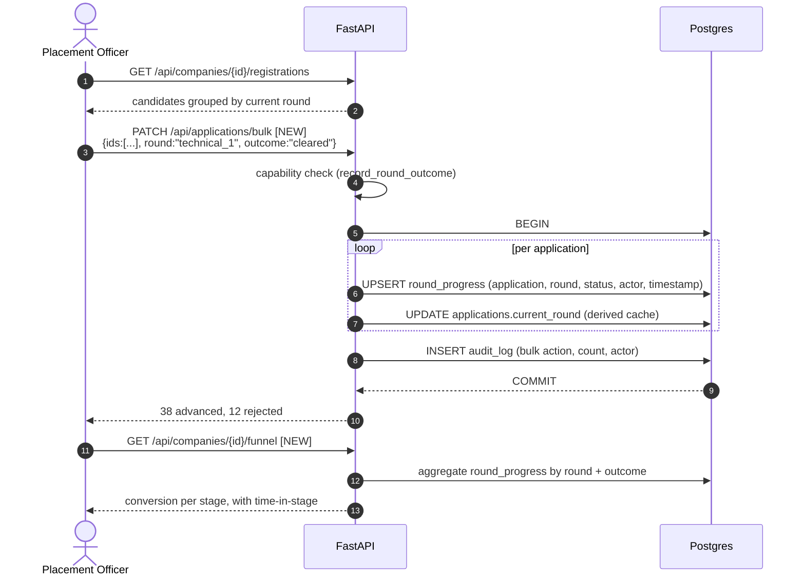
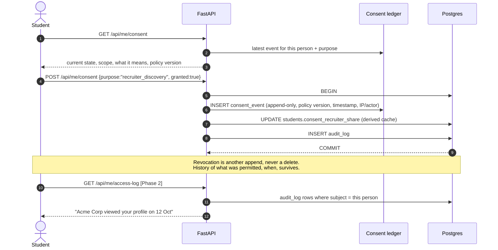
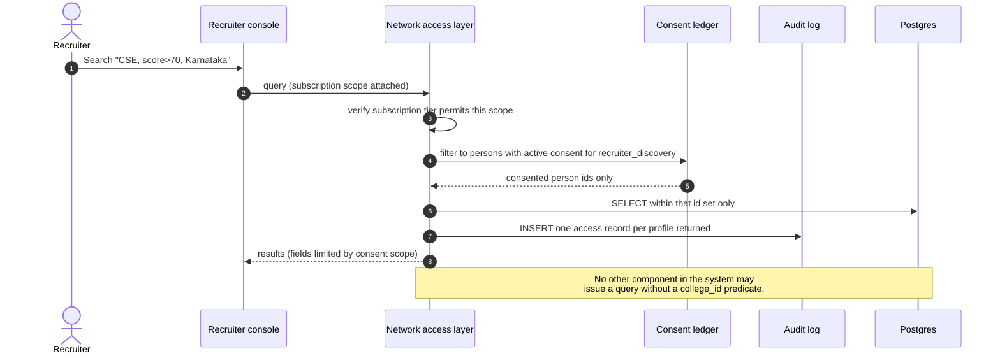

# Use cases and sequence models

Actors, the use-case catalogue with phase assignment, and sequence diagrams for the flows that carry the most product risk.

---

## 1. Actors

| Actor | Who they really are | What success looks like for them |
|---|---|---|
| **Placement Officer (PO)** | Usually one person, sometimes with an assistant, running placements for the whole college. Often also teaches. Overloaded. | "I know what needs my attention today, and I stopped re-typing data into spreadsheets." |
| **Placement Head / Dean** | Signs off, reports to management, cares about numbers and accreditation | "I can see placement performance without asking anyone for a report." |
| **CR (branch representative)** | A student, usually final year, doing operational legwork for their branch. Unpaid, changes every year. | "I know exactly what I'm responsible for, and I'm not blamed for things outside it." |
| **Student** | Wants a job; confused about eligibility and deadlines | "I know what I'm eligible for, why not, and what to do next." |
| **Alumni** | Placed student, source of interview experiences | Low-friction way to give back |
| **Recruiter / Company SPOC** | Coordinates a drive with the college. *Not a platform user in Phase 1* | Fewer emails, cleaner candidate lists |
| **Platform Operator (owner)** | You. Onboarding, support, incident response | Onboard a college without writing code |
| **Talent Recruiter (Phase 2)** | Company user searching across colleges | Finds relevant, consented, verified candidates |

Two notes that matter for design. The CR turns over **every academic year**, so any workflow that depends on CR institutional memory will break annually — this is an argument for the capability matrix being explicit and self-describing rather than tribal knowledge. And the PO is frequently not technical and is doing this alongside a teaching load, which is the real reason "easier than building it ourselves" wins: the college's own portal, if built, would be maintained by whichever student built it, and then abandoned.

---

## 2. Use-case catalogue

Priority: **P0** = required for a first real pilot college, **P1** = required to sell to the tenth college, **P2** = later. Phase per the vision boundary.

### Onboarding and administration

| ID | Use case | Actor | Priority | Phase | Status today |
|---|---|---|---|---|---|
| UC-01 | Create a college tenant with branches | Operator | P0 | 1 | Manual / SQL |
| UC-02 | Appoint the placement officer | Operator | P0 | 1 | Manual |
| UC-03 | Import student roster from CSV with column mapping | PO | P0 | 1 | Exists (`/api/students/import`) |
| UC-04 | Review import errors and re-import safely | PO | P0 | 1 | Partial |
| UC-05 | Define college-specific student attributes | PO | P1 | 1 | Exists (`attribute_defs`) |
| UC-06 | Configure placement policy (slabs, caps, upgrade rules) | PO | P0 | 1 | Exists (`/api/policy`) |
| UC-07 | Appoint a CR and grant scoped capabilities | PO | P0 | 1 | Exists (migration `0007`) |
| UC-08 | Revoke a CR at year end | PO | P0 | 1 | Gap — no revocation flow |
| UC-09 | Self-service college onboarding, zero engineering | Operator | P1 | 1 | **The Phase 1 exit criterion** |

### Student identity

| ID | Use case | Actor | Priority | Phase | Status today |
|---|---|---|---|---|---|
| UC-10 | Sign in with Google, auto-matched to roster | Student | P0 | 1 | Exists |
| UC-11 | Claim account with roll number + activation code | Student | P0 | 1 | Exists |
| UC-12 | Issue and distribute activation codes per branch | PO / CR | P0 | 1 | Exists (export) |
| UC-13 | Request a correction to roster data | Student | P1 | 1 | Exists (`edit_requests`) |
| UC-14 | Approve or reject a correction | PO | P1 | 1 | Exists |

### Drives and eligibility

| ID | Use case | Actor | Priority | Phase | Status today |
|---|---|---|---|---|---|
| UC-15 | Create a drive as draft | PO | P0 | 1 | Exists |
| UC-16 | Build eligibility rules visually | PO | P0 | 1 | Exists (rule tree + preview) |
| UC-17 | Preview which students qualify before publishing | PO | P0 | 1 | Exists (`eligibility-preview`) |
| UC-18 | **Publish** a drive to students | PO | P0 | 1 | Gap — status edit, not an action; drafts leak (F-2) |
| UC-19 | See my drives with eligibility verdict and reasons | Student | P0 | 1 | Exists — the standout feature |
| UC-20 | Register for a drive | Student | P0 | 1 | Exists, gated correctly |
| UC-21 | Withdraw before the deadline | Student | P1 | 1 | Gap |
| UC-22 | Close a drive / extend a deadline | PO | P1 | 1 | Partial |

### Pipeline and outcomes

| ID | Use case | Actor | Priority | Phase | Status today |
|---|---|---|---|---|---|
| UC-23 | See all registrations for a drive | PO / CR | P0 | 1 | Exists |
| UC-24 | Advance candidates through rounds, in bulk | PO / CR | P0 | 1 | Single-record only |
| UC-25 | Record a round outcome with history and actor | PO / CR | P0 | 1 | **Gap — `round_progress` unused** |
| UC-26 | Record an offer and mark placed | PO | P0 | 1 | Exists |
| UC-27 | Enforce policy on further drives after an offer | System | P0 | 1 | Exists (`check_policy`) |
| UC-28 | Export shortlist for the company | PO | P1 | 1 | Gap |

### Communication and support

| ID | Use case | Actor | Priority | Phase | Status today |
|---|---|---|---|---|---|
| UC-29 | Ask a question | Student | P1 | 1 | Exists |
| UC-30 | Escalate a branch question to the PO | CR | P1 | 1 | Exists, creates notification |
| UC-31 | Answer publicly so the college benefits | PO | P1 | 1 | Exists |
| UC-32 | Announce to a branch or college | PO / CR | P1 | 1 | Gap — no announcements |
| UC-33 | Notify students of deadlines | System | P1 | 1 | Gap — in-app only, no email/push |
| UC-34 | Write an interview experience | Student / Alumni | P1 | 1 | Exists |

### Analytics and reporting

| ID | Use case | Actor | Priority | Phase | Status today |
|---|---|---|---|---|---|
| UC-35 | Live placement dashboard | PO | P0 | 1 | Exists |
| UC-36 | Branch and category breakdown | PO / Head | P1 | 1 | Exists (`/api/analytics`) |
| UC-37 | Stage-conversion funnel per drive | PO | P1 | 1 | Blocked on UC-25 |
| UC-38 | **NAAC / NBA / NIRF-format placement report export** | Head | P0 | 1 | Gap — high commercial value |
| UC-39 | Year-on-year comparison | Head | P2 | 1 | Needs season modelling |
| UC-40 | Anonymised peer benchmarking | Head | P2 | 1.5 | Needs multi-college density |

### Data foundation (Phase 1.5) and network (Phase 2)

| ID | Use case | Actor | Priority | Phase | Status today |
|---|---|---|---|---|---|
| UC-41 | Grant / revoke consent for recruiter visibility | Student | P1 | 1.5 | Boolean only — needs ledger |
| UC-42 | Link and verify public coding profiles | Student | P2 | 1.5 | Exists, unverified |
| UC-43 | See my score and how to improve it | Student | P2 | 1.5 | Exists, gameable |
| UC-44 | See who accessed my profile | Student | P2 | 2 | Needs audit log |
| UC-45 | Take a common assessment | Student | P2 | 2 | Not built — correctly |
| UC-46 | Search consented candidates across colleges | Recruiter | P2 | 2 | Not built — correctly |
| UC-47 | Company subscription and billing | Recruiter | P2 | 2 | Not built |

**Reading the table:** the P0 gaps are UC-08, UC-18, UC-24, UC-25 and UC-38, plus the security findings. That is a small, concrete list — which is the useful conclusion. This product is closer to pilot-ready than the vision document assumes.

---

## 3. Sequence diagrams

### 3.1 Student registers for a drive (the most-executed flow)

Every gate in this diagram exists in `portal.py::register_for_drive` today, in this order.

```mermaid
sequenceDiagram
    autonumber
    actor S as Student
    participant UI as Web app
    participant API as FastAPI
    participant EL as Eligibility engine
    participant DB as Postgres (RLS)

    S->>UI: Open Drives
    UI->>API: GET /api/me/drives (JWT)
    API->>DB: BEGIN; SET LOCAL app.* from claims
    DB-->>API: student attrs, existing offers, college policy, drives
    loop per drive
        API->>EL: check_policy(policy, offers, package)
        API->>EL: evaluate_rules(rules, student)
        EL-->>API: eligible? + human reasons
    end
    API-->>UI: drives with verdict + reasons
    UI-->>S: "Eligible for 4 of 7 — here's why not for the rest"

    S->>UI: Register for Nova Analytics
    UI->>API: POST /api/me/register/{id}
    API->>DB: drive open? deadline passed?
    API->>DB: resume on file?
    API->>EL: re-run policy + rules (never trust the client)
    alt any gate fails
        API-->>UI: 403 with the specific reason
        UI-->>S: Shows exactly which condition failed
    else all pass
        API->>DB: INSERT application (UNIQUE prevents duplicates)
        API->>DB: INSERT audit_log [NEW]
        DB-->>API: COMMIT
        API-->>UI: registered
    end
```

The re-evaluation on POST is the important detail: eligibility shown in a list is advisory, eligibility at registration is authoritative. Keep it that way even though it costs a few milliseconds.

### 3.2 Officer creates and publishes a drive

```mermaid
sequenceDiagram
    autonumber
    actor PO as Placement Officer
    participant UI as Web app
    participant API as FastAPI
    participant EL as Eligibility engine
    participant DB as Postgres

    PO->>UI: New drive → fill details
    UI->>API: POST /api/companies (status=draft)
    API->>DB: INSERT (draft)
    PO->>UI: Build eligibility rules
    UI->>API: PUT /api/companies/{id}/rules
    API->>EL: validate rule tree (depth, ops, count)
    alt invalid
        EL-->>API: RuleError
        API-->>UI: 422 with the offending condition
    else valid
        API->>DB: store eligibility_rules jsonb
    end
    PO->>UI: Preview qualifying students
    UI->>API: GET /api/companies/{id}/eligibility-preview
    API->>EL: evaluate against whole roster
    API-->>UI: counts by branch + sample + failure reasons
    PO->>UI: PUBLISH
    UI->>API: POST /api/companies/{id}/publish  [NEW — capability: publish_drive]
    API->>API: require_placement_officer (CR may never publish)
    API->>DB: status draft→open; INSERT audit_log
    API->>DB: fan out notifications to eligible students [NEW]
    API-->>UI: published
```

Publish is modelled as its own endpoint rather than a `PATCH status` for three reasons: it is the moment student-visible state changes, it is the natural audit boundary, and it is where the notification fan-out belongs.

### 3.3 CR escalates a question (the hierarchy in action)

```mermaid
sequenceDiagram
    autonumber
    actor ST as Student
    actor CR as CR (sub_admin)
    actor PO as Placement Officer
    participant API as FastAPI
    participant PERM as Capability check
    participant DB as Postgres

    ST->>API: POST /api/me/questions
    API->>DB: INSERT question (branch-scoped, status=open)

    CR->>API: GET /api/questions
    API->>PERM: require_cr_capability("manage_branch_questions")
    PERM-->>API: granted
    API->>DB: SELECT — RLS limits to CR's branch
    DB-->>API: branch questions only

    CR->>API: PATCH /api/questions/{id} (escalate)
    API->>PERM: capability check
    API->>DB: BEGIN
    API->>DB: question.status = escalated
    API->>DB: INSERT notification (recipient_role=admin, unique per question)
    DB-->>API: COMMIT

    PO->>API: GET /api/notifications
    API->>DB: admin inbox
    PO->>API: PATCH /api/questions/{id} (answer)
    Note over API,DB: Only admin may answer — CR capability<br/>cannot include answering
    API->>DB: status=answered; visible college-wide
```

Two properties worth preserving from the existing implementation: the notification is addressed to a **role**, not a person, so a college with two officers doesn't lose the item if one is away; and the unique constraint on `(college_id, recipient_role, kind, resource_type, resource_id)` makes escalation idempotent — a CR clicking twice doesn't create two items.

### 3.4 Roster import

```mermaid
sequenceDiagram
    autonumber
    actor PO as Placement Officer
    participant UI as Web app
    participant API as FastAPI
    participant DB as Postgres

    PO->>UI: Upload roster.csv
    UI->>API: POST /api/students/import (dry_run=true) [NEW]
    API->>API: parse; map columns to core fields + attribute_defs
    API->>DB: check existing roll numbers (UNIQUE college_id, roll_no)
    API-->>UI: preview — N new, M updates, K errors with row numbers
    UI-->>PO: "Row 42: CGPA 'N/A' is not a number"
    PO->>UI: Fix and confirm
    UI->>API: POST /api/students/import (dry_run=false)
    API->>DB: BEGIN; upsert rows; generate activation codes for new
    API->>DB: INSERT audit_log (actor, file hash, counts)
    DB-->>API: COMMIT
    API-->>UI: imported N, updated M
    PO->>API: GET /api/students/activation-codes?branch=CSE
    API-->>PO: CSV for distribution
```

The dry-run preview is the single highest-value addition to an existing feature in this document. Roster import is the first thing a new college does, it is where their data is messiest, and a failed import on day one is how a pilot dies. A preview that names the bad rows converts that from a crisis into a five-minute fix.

### 3.5 Pipeline progression with history (proposed)



### 3.6 Consent, as it should work (Phase 1.5)



The last step is what makes consent credible to a student rather than a checkbox they clicked once. It is Phase 2 to *show*, but the data must be captured from Phase 1 or there is nothing to show.

### 3.7 Phase 2 network access — the only cross-tenant path

Included to define the seam, not to build it.



---

## 4. What these models say about priorities

Three conclusions fall out of the catalogue rather than from opinion:

The **P0 gap list is short** — CR revocation, publish-as-an-action, bulk round updates with history, and accreditation-format export. Everything else at P0 already exists. That is a weeks-not-months list, and it means the honest blocker to a pilot is correctness and onboarding, not features.

**UC-19 is the product's sharpest edge.** "You are eligible for 4 of 7 drives, and here is precisely why not for the other 3" is a feature that placement portals — including internally built ones — almost universally lack, because it requires the rule engine to produce human reasons rather than a boolean. That already works. It should be the centrepiece of every demo and the loudest thing in the student UI.

**UC-38 is the commercial unlock.** Placement statistics feed NAAC, NBA and NIRF submissions, and preparing them is currently a manual, painful, annual exercise usually done by the same overloaded officer. A one-click, correctly formatted export moves the purchase from "nice software" to "this pays for itself in the accreditation cycle" — and, critically, it moves the budget conversation from the placement cell's small discretionary spend to the institution's compliance budget.
